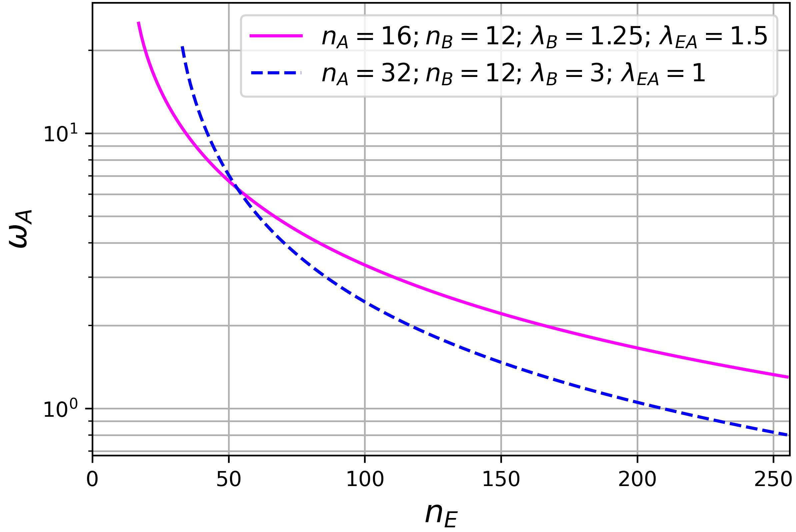
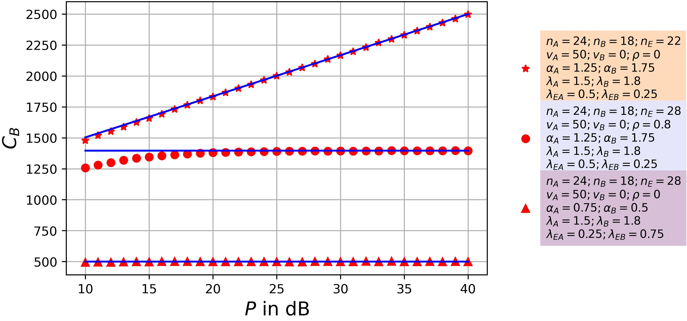

# Secret-Key Capacity From MIMO Channel Probing

Run [illust.py](illust.py) to obtain illustration plots of the secrecy rate. For plots illustrating analytical secrecy rate and secrecy rate obtained from simulation, run [simu.py](simu.py). For detailed description, please refer to our [MILCOM23](https://ieeexplore.ieee.org/document/10356312) and [WCL24](https://ieeexplore.ieee.org/document/10460260) papers and [slides](https://drive.google.com/file/d/11RQQV1bxjYtt4QUiLFnWyPYyDkho_1rw/view?usp=sharing).

## Introduction
A central problem of physical layer security (PLS) is for two friendly nodes (Alice and Bob) to exchange a secret message against an eavesdropper (Eve). The WireTapChannel (WTC) approach by Wyner has been widely studied
and facilitated by revealing expressions of its secrecy capacity. Given the same system of channels, the SecretKeyGeneration (SKG) approach by Maurer is also applicable. But no exact expression of the Secret Key Capacity for any MIMO channels was available until this work.

## System Model and Analysis
Let, Alice, Bob, and Eve have $n_A$, $n_B$, and $n_E$ antennas. According to the WTC model, the secrecy rate (secrecy per symbol interval) goes to zero if Eve has more antennas than Alice and Bob and also has better SNR. However our work based on Maurer's bounds reveals that the secrecy rate is positive in such scenarios (Eve having more antenna and better SNR that Alice and Bob). 

The above plot shows the secrecy rate from Alice to Bob being positive even in the scenario of Eve having better SNR (the ratios given as $λ$ s) and more antennas. The plot below shows the experimentally obtained secrecy rates through simulations, and the analytical expressions are consistent. 
